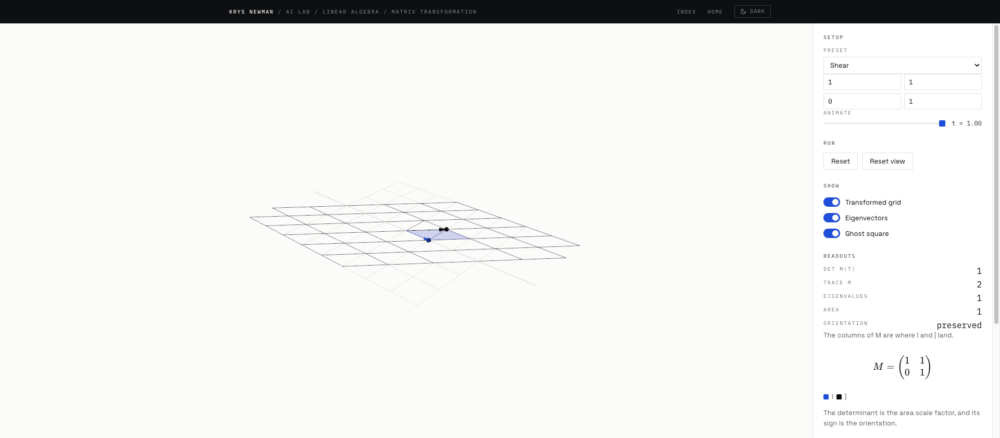
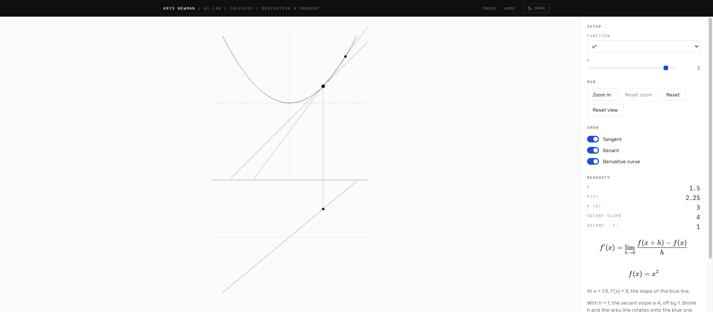
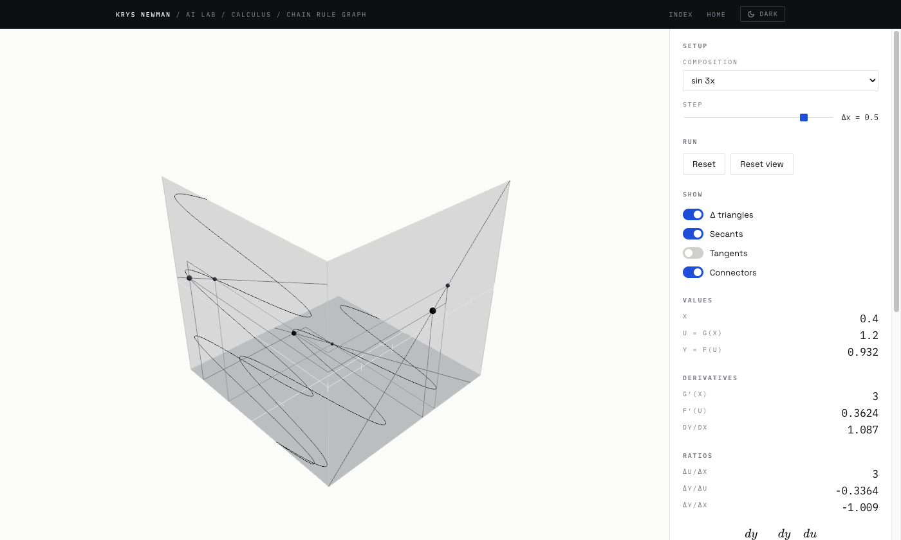
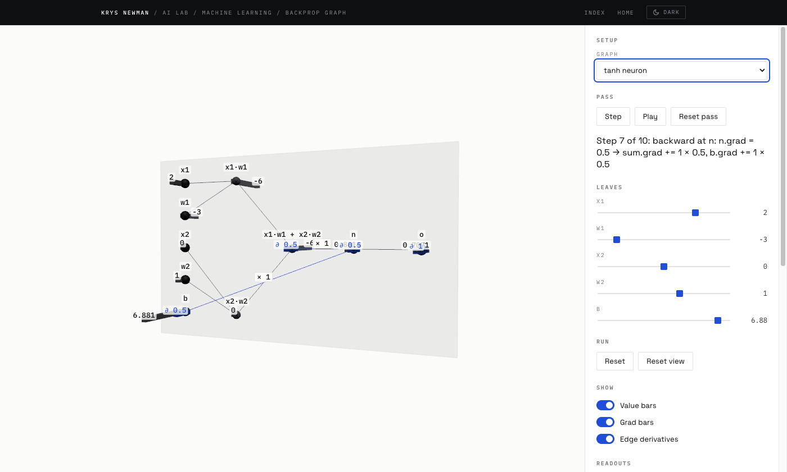

# AI Lab

Interactive 3D visualizations for calculus, linear algebra and machine learning, built as
a study tool and a portfolio piece. Live at
[knewman23.github.io/ai-lab](https://knewman23.github.io/ai-lab/).







## What's in it

Five scenes so far.

**Gradient descent** on a draggable 3D loss surface. Drag the ball anywhere on the surface
and watch the gradient arrow and tangent plane follow it, pick SGD, momentum or Adam and
step or run the optimizer to trace its path, switch between five surfaces (a convex bowl,
an elongated bowl, a saddle, Himmelblau's function and the Rosenbrock valley), and read
live KaTeX equations and readouts that update as you go.

**Matrix transformation** on the plane. Drag the tips of the two basis vectors, or type the
four entries, and watch the grid and the unit square deform under the matrix; the fill turns
warn-coloured when the determinant flips sign, the eigenvectors are drawn as the lines that
don't turn, and an Animate slider morphs the whole plane from the identity.

**Derivative and tangent explorer.** Drag a point along one of six curves and watch the tangent
follow it, shrink h to see the secant rotate onto the tangent while the readouts converge, and
read the derivative as the height of a second curve drawn underneath. Two curves are not
differentiable at zero: |x| shows the corner, √|x| the vertical tangent. Zoom in three times to
see any smooth curve become its tangent.

**Chain rule graph.** Three graphs meet in a corner: u = g(x) on the front wall, y = f(u) on the
side wall and the composite y = f(g(x)) on the floor. Drag x on the front wall or the floor and set a Δx with the
slider; the Δu leg is shared by both walls and the Δy leg by the side wall and the floor, so
Δy/Δx = (Δy/Δu)(Δu/Δx) is there to be read off the picture. Shrink Δx and the three secants become
tangents while the readouts converge on the product of the derivatives. Five presets of f and g.

**Backprop graph.** The `Value` autograd graph from the first ai-frontier notebook, laid out on a
wall with a value bar and a gradient bar sticking out of every node. Step or play the forward pass
and watch values fill in node by node; step the backward pass and watch gradients flow back along
each edge with the local derivative written on it. Drag a leaf's bar or move its slider and every
revealed number recomputes. Three graphs: the tanh neuron, a·b + c, and one where a node feeds two
consumers so its gradient visibly accumulates.

## Run it

Requires Node 24 and pnpm 10.

```sh
pnpm install
pnpm dev      # local dev server
pnpm check    # typecheck, lint, format check, tests
pnpm build    # production build
```

## How it's built

The app shell owns a single renderer (`WebGPURenderer`, falling back to WebGL 2) and the
animation loop; each visualization is a folder that exports one object, owns its own
scene, camera and controls, and renders itself inside `update`. All surface math and
optimizer state live in pure, framework-free, unit-tested functions, checked against
finite differences. There's no UI framework: panels and controls are small DOM helpers.
Colours are read from the portfolio's CSS custom properties at runtime, so the 3D scene
flips between light and dark along with the page theme.

## Add a visualization

Every visualization is a folder exporting one object matching this shape (see
`src/viz/types.ts`). The registry holds the card metadata plus a loader, so each
scene ships as its own chunk and the home page never downloads Three.js:

```ts
export interface Visualization {
  id: string;
  topic: "calculus" | "linear-algebra" | "machine-learning";
  title: string;
  summary: string;
  status: "ready";
  mount(host: VizHost): VizInstance;
}

export interface VizInstance {
  update(dt: number): boolean; // render here; return true if it rendered
  resize(w: number, h: number): void;
  dispose(): void; // release all GPU resources and listeners
}

// What the registry stores: the same card metadata, and a loader for the module.
export interface LazyVisualization extends Omit<RoadmapEntry, "status"> {
  readonly status: "ready";
  readonly load: () => Promise<Visualization>;
}
```

A minimal example, a spinning cube in its own folder:

```ts
import { BoxGeometry, Mesh, MeshStandardMaterial } from "three";
import { createSceneKit, disposeObject, prefersReducedMotion } from "../../core/scene";
import type { Visualization, VizHost, VizInstance } from "../types";

function mount(host: VizHost): VizInstance {
  const kit = createSceneKit(host.renderer, host.theme, {
    reducedMotion: prefersReducedMotion(),
  });
  const cube = new Mesh(new BoxGeometry(1, 1, 1), new MeshStandardMaterial());
  kit.scene.add(cube);
  return {
    // A spinning cube always animates, so it always renders and always returns
    // true; a scene that can sit still must return false on the frames it skips.
    update(dt) {
      cube.rotation.z += dt;
      kit.controls.update(dt);
      host.renderer.render(kit.scene, kit.camera);
      return true;
    },
    resize(w, h) {
      kit.camera.aspect = w / h;
      kit.camera.updateProjectionMatrix();
    },
    // The cube is still attached, so the scene sweep disposes it exactly once.
    dispose() {
      disposeObject(kit.scene);
      kit.dispose();
    },
  };
}

export const spinningCube: Visualization = {
  id: "spinning-cube",
  topic: "machine-learning",
  title: "Spinning cube",
  summary: "A cube rotating on the Z axis, the smallest thing that fills a frame.",
  status: "ready",
  mount,
};
```

Then register it in `src/app/registry.ts`, repeating the card metadata and
pointing `load` at the folder:

```ts
{
  id: "spinning-cube",
  topic: "machine-learning",
  title: "Spinning cube",
  summary: "A cube rotating on the Z axis, the smallest thing that fills a frame.",
  status: "ready",
  load: () => import("../viz/spinning-cube").then((m) => m.spinningCube),
},
```

The registry test asserts the loaded module's `id`, `topic`, `title` and
`summary` match the entry, so the two copies cannot drift.

## Roadmap

1. ~~Matrix transformation (linear algebra)~~ — shipped: drag the two basis vectors of a 2×2
   matrix, watch the plane and unit square deform, see the determinant as signed area and
   eigenvectors as the lines that don't turn.
2. ~~Backprop graph (machine learning)~~ — shipped: the `Value` autograd graph on a wall with value
   and gradient bars, a stepped forward and backward pass, local derivatives on the active edges,
   and editable leaves.
3. Neural network (machine learning) — a small MLP with a live forward pass and training.
4. GPT transformer (machine learning) — token embeddings, attention heads, residual stream.
5. ~~Derivative & tangent explorer (calculus)~~ — shipped: drag a point along a curve on a
   vertical plane, watch the tangent follow, shrink h to collapse the secant onto it, read the
   derivative curve in the band underneath, and zoom the domain until the curve straightens.
6. Walkthrough mode (shell) — optional numbered steps that reconfigure any scene.

## Related

- [ai-frontier](https://github.com/knewman23/ai-frontier) — from-scratch ML notebooks
- [backprop-to-frontier](https://github.com/knewman23/backprop-to-frontier) — curriculum
- [knewman23.github.io](https://github.com/knewman23/knewman23.github.io) — portfolio site
