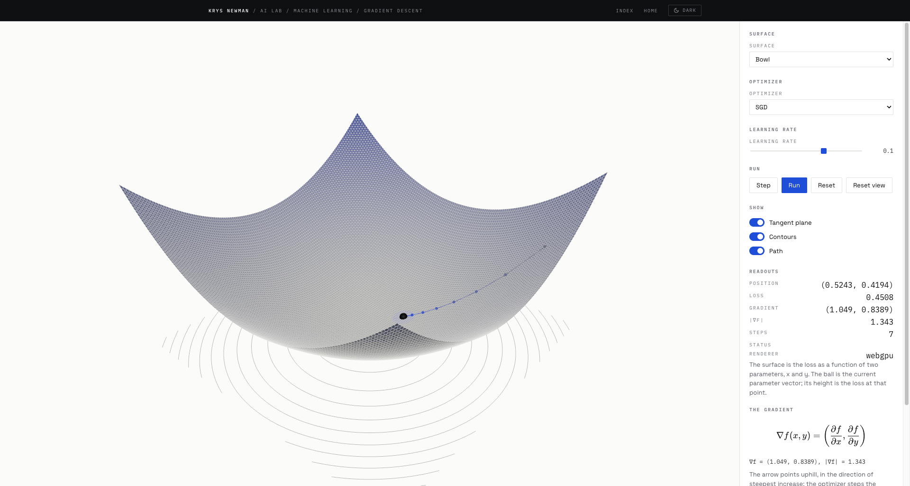

# AI Lab

Interactive 3D visualizations for calculus, linear algebra and machine learning, built as
a study tool and a portfolio piece. Live at
[knewman23.github.io/ai-lab](https://knewman23.github.io/ai-lab/).



## What's in it

The first release ships one scene: gradient descent on a draggable 3D loss surface. Drag
the ball anywhere on the surface and watch the gradient arrow and tangent plane follow it,
pick SGD, momentum or Adam and step or run the optimizer to trace its path, switch between
five surfaces (a convex bowl, an elongated bowl, a saddle, Himmelblau's function and the
Rosenbrock valley), and read live KaTeX equations and readouts that update as you go.

## Run it

Requires Node 24 and pnpm 10.

```sh
pnpm install
pnpm dev      # local dev server
pnpm check    # typecheck, lint, format check, tests
pnpm build    # production build
```

## How it's built

The app shell owns a single renderer (`WebGPURenderer`, falling back to WebGL 2) and the
animation loop; each visualization is a folder that exports one object, owns its own
scene, camera and controls, and renders itself inside `update`. All surface math and
optimizer state live in pure, framework-free, unit-tested functions, checked against
finite differences. There's no UI framework: panels and controls are small DOM helpers.
Colours are read from the portfolio's CSS custom properties at runtime, so the 3D scene
flips between light and dark along with the page theme.

## Add a visualization

Every visualization is a folder exporting one object matching this shape (see
`src/viz/types.ts`):

```ts
export interface Visualization {
  id: string;
  topic: "calculus" | "linear-algebra" | "machine-learning";
  title: string;
  summary: string;
  status: "ready";
  mount(host: VizHost): VizInstance;
}

export interface VizInstance {
  update(dt: number): boolean; // render here; return true if it rendered
  resize(w: number, h: number): void;
  dispose(): void; // release all GPU resources and listeners
}
```

A minimal example, a spinning cube in its own folder:

```ts
import { BoxGeometry, Mesh, MeshStandardMaterial } from "three";
import { createSceneKit, disposeObject, prefersReducedMotion } from "../../core/scene";
import type { Visualization, VizHost, VizInstance } from "../types";

function mount(host: VizHost): VizInstance {
  const kit = createSceneKit(host.renderer, host.theme, {
    reducedMotion: prefersReducedMotion(),
  });
  const cube = new Mesh(new BoxGeometry(1, 1, 1), new MeshStandardMaterial());
  kit.scene.add(cube);
  return {
    // A spinning cube always animates, so it always renders and always returns
    // true; a scene that can sit still must return false on the frames it skips.
    update(dt) {
      cube.rotation.z += dt;
      kit.controls.update(dt);
      host.renderer.render(kit.scene, kit.camera);
      return true;
    },
    resize(w, h) {
      kit.camera.aspect = w / h;
      kit.camera.updateProjectionMatrix();
    },
    // The cube is still attached, so the scene sweep disposes it exactly once.
    dispose() {
      disposeObject(kit.scene);
      kit.dispose();
    },
  };
}

export const spinningCube: Visualization = {
  id: "spinning-cube",
  topic: "machine-learning",
  title: "Spinning cube",
  summary: "A cube rotating on the Z axis, the smallest thing that fills a frame.",
  status: "ready",
  mount,
};
```

Then register it in `src/app/registry.ts`.

## Roadmap

1. Backprop graph (machine learning) — the `Value` autograd graph laid out in 3D.
2. Matrix transformation (linear algebra) — drag basis vectors, watch a cube and point
   cloud deform, see determinant as volume and eigenvectors as the lines that don't turn.
3. Neural network (machine learning) — a small MLP with a live forward pass and training.
4. GPT transformer (machine learning) — token embeddings, attention heads, residual stream.
5. Derivative & tangent explorer (calculus) — 1D secant-to-tangent limit animation.
6. Walkthrough mode (shell) — optional numbered steps that reconfigure any scene.

## Related

- [ai-frontier](https://github.com/knewman23/ai-frontier) — from-scratch ML notebooks
- [backprop-to-frontier](https://github.com/knewman23/backprop-to-frontier) — curriculum
- [knewman23.github.io](https://github.com/knewman23/knewman23.github.io) — portfolio site
